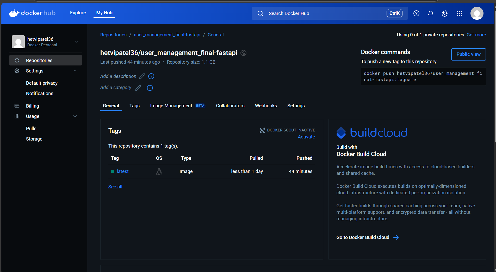

# The User Management System Final Project: Your Epic Coding Adventure Awaits! 🎉✨🔥

## Reflection Document
[click_here](https://docs.google.com/document/d/1d5hE5AL82Cw51x03yNJM6t4-dn408QugRSyOQGnjcfI/edit?usp=sharing)

## Closed Issues (Bug Fixes)

1. **Bug #1:** [The user ID is None when you click on Verify Email.](https://github.com/hnp36/user_management_final/issues/3)
  ## Description
- Click on Verify Email in the email received
- The error occurs with no user ID in the URL

2. **Bug #2:** [Updated password requirements for enhanced security](https://github.com/hnp36/user_management_final/issues/5)
 ## Description
n the previous implementation of the UserCreate class, there was no validation for password strength, allowing weak passwords to be accepted. This oversight could lead to security vulnerabilities, as users could create passwords that are easy to guess or susceptible to brute-force attacks.

Steps to Reproduce:
Use the UserCreate class to create a new user with a weak password (for example, "password123" or "12345678").
Observe that no error is raised, and the weak password is accepted.
This lack of validation fails to enforce strong password policies, ultimately reducing the overall security of the system.

Summary of Password Validation Fix:
A function named validate_password_strength() was created to enforce the following password requirements:

At least 8 characters long
Mixed case letters
Inclusion of numbers
Use of special characters
Avoidance of common passwords
This function has been applied to the UserCreate, UserUpdate, and LoginRequest classes. Comprehensive tests for validation rules and various edge cases have also been added.

3. **Bug #3:** [Missing Parameter Check ](https://github.com/hnp36/user_management_final/issues/7)
 ## Description
Missing Parameter Check
Steps to reproduce:

1.Access the User Management Swagger UI at: http://localhost/docs
2.Navigate to the Login and Registration section.
3.Click on the 'Try it Out' link in the' Post Register' section.
4.Enter the details for a new user in the request body and click "Execute."
5.Open the database using the link: http://localhost:5050/browser.
6.Update the is_professional flag for any user to "true" in the database.
7.Go back to the User Management Swagger UI at: http://localhost/docs
8.In the GET/USERS section, provide the UUID (unique identifier) of the user whose is_professional flag you changed to "true."
9.You will encounter an error: the user details retrieved will still show the is_professional flag as "false," regardless of the updated value.

To resolve this issue, modify the user_routes.py file by adding the is_professional flag.

After implementing this fix, the user will correctly display the accurate value of the is_professional flag when their details are retrieved from Swagger.

4. **Bug #4:** [There was an incorrect assignment of roles during the verification of the admin email.](https://github.com/hnp36/user_management_final/issues/9)
 ## Description
 In the current implementation of verify_email_with_token, users who verify their email address are assigned the role of AUTHENTICATED, regardless of their original role. This behavior unintentionally overwrites roles such as ADMIN or MANAGER, resulting in permission downgrades.
 I identified that the 'verify_email_with_token' method only checked for the ANONYMOUS role, but it required improved logging. Upon investigation, I found the primary issue was in the 'create' method, which was not honoring the roles provided in the input data. I modified the 'create' method to verify whether a role was explicitly set before applying the default role assignment logic. Additionally, I added detailed logging throughout the authentication flow to facilitate easier troubleshooting.

5. **Bug #5:** [Modify the Dockerfile to permit building with a specific allowed version of libc-bin.](https://github.com/hnp36/user_management_final/issues/12)
 ## Description
 Allows libc-bin to be reverted to the specified version (2.36-9+deb12u7) via package manager downgrade.

## NewFeature

# Localization Support :
Added support for multi-language functionality, enabling users to choose their preferred language for API responses and interface content. This feature includes dynamic language switching, fallback mechanisms for untranslated content, and timezone management. Translation resources are organized into files for easy updates and maintenance.

This localization feature allows the application to cater to a global audience by supporting multiple languages based on user preferences. It ensures that user-facing text in API responses and interface elements can be translated seamlessly. The implementation involves integrating a localization library, defining supported languages, creating translation files, and updating the codebase to utilize localized text. Additional features include real-time language switching, fallback support for missing translations, and proper timezone adjustments. Comprehensive unit tests have been added to validate the functionality and reliability of the localization system.

## DockerHub

[DockerHub Repository](https://hub.docker.com/repository/docker/hetvipatel36/user_management_final-fastapi/general)

## Introduction: Buckle Up for the Ride of a Lifetime 🚀🎬

Welcome to the User Management System project - an epic open-source adventure crafted by the legendary Professor Keith Williams for his rockstar students at NJIT! 🏫👨‍🏫⭐ This project is your gateway to coding glory, providing a bulletproof foundation for a user management system that will blow your mind! 🤯 You'll bridge the gap between the realms of seasoned software pros and aspiring student developers like yourselves. 

### [Instructor Video - Project Overview and Tips](https://youtu.be/gairLNAp6mA) 🎥

- [Introduction to the system features and overview of the project - please read](system_documentation.md) 📚
- [Project Setup Instructions](setup.md) ⚒️
- [Features to Select From](features.md) 🛠️
- [About the Project](about.md)🔥🌟

## Goals and Objectives: Unlock Your Coding Superpowers 🎯🏆🌟

Get ready to ascend to new heights with this legendary project:

1. **Practical Experience**: Dive headfirst into a real-world codebase, collaborate with your teammates, and contribute to an open-source project like a seasoned pro! 💻👩‍💻🔥
2. **Quality Assurance**: Develop ninja-level skills in identifying and resolving bugs, ensuring your code quality and reliability are out of this world. 🐞🔍⚡
3. **Test Coverage**: Write additional tests to cover edge cases, error scenarios, and important functionalities - leave no stone unturned and no bug left behind! ✅🧪🕵️‍♂️
4. **Feature Implementation**: Implement a brand new, mind-blowing feature and make your epic mark on the project, following best practices for coding, testing, and documentation like a true artisan. ✨🚀🎆
5. **Collaboration**: Foster teamwork and collaboration through code reviews, issue tracking, and adhering to contribution guidelines - teamwork makes the dream work, and together you'll conquer worlds! 🤝💪🌍
6. **Industry Readiness**: Prepare for the software industry by working on a project that simulates real-world development scenarios - level up your skills to super hero status  and become an unstoppable coding force! 🔝🚀🏆⚡

## Submission and Grading: Your Chance to Shine 📝✏️📈

1. **Reflection Document**: Submit a 1-2 page Word document reflecting on your learnings throughout the course and your experience working on this epic project. Include links to the closed issues for the **5 QA issues, 10 NEW tests, and 1 Feature** you'll be graded on. Make sure your project successfully deploys to DockerHub and include a link to your Docker repository in the document - let your work speak for itself! 📄🔗💥

2. **Commit History**: Show off your consistent hard work through your commit history like a true coding warrior. **Projects with less than 10 commits will get an automatic 0 - ouch!** 😬⚠️ A significant part of your project's evaluation will be based on your use of issues, commits, and following a professional development process like a boss - prove your coding prowess! 💻🔄🔥

3. **Deployability**: Broken projects that don't deploy to Dockerhub or pass all the automated tests on GitHub actions will face point deductions - nobody likes a buggy app! 🐞☠️ Show the world your flawless coding skills!

## Managing the Project Workload: Stay Focused, Stay Victorious ⏱️🧠⚡

This project requires effective time management and a well-planned strategy, but fear not - you've got this! Follow these steps to ensure a successful (and sane!) project outcome:

1. **Select a Feature**: [Choose a feature](features.md) from the provided list of additional improvements that sparks your interest and aligns with your goals like a laser beam. ✨⭐🎯 This is your chance to shine!

2. **Quality Assurance (QA)**: Thoroughly test the system's major functionalities related to your chosen feature and identify at least 5 issues or bugs like a true detective. Create GitHub issues for each identified problem, providing detailed descriptions and steps to reproduce - the more detail, the merrier! 🔍🐞🕵️‍♀️ Leave no stone unturned!

3. **Test Coverage Improvement**: Review the existing test suite and identify gaps in test coverage like a pro. Create 10 additional tests to cover edge cases, error scenarios, and important functionalities related to your chosen feature. Focus on areas such as user registration, login, authorization, and database interactions. Simulate the setup of the system as the admin user, then creating users, and updating user accounts - leave no stone unturned, no bug left behind! ✅🧪🔍🔬 Become the master of testing!

4. **New Feature Implementation**: Implement your chosen feature, following the project's coding practices and architecture like a coding ninja. Write appropriate tests to ensure your new feature is functional and reliable like a rock. Document the new feature, including its usage, configuration, and any necessary migrations - future you will thank you profusely! 🚀✨📝👩‍💻⚡ Make your mark on this project!

5. **Maintain a Working Main Branch**: Throughout the project, ensure you always have a working main branch deploying to Docker like a well-oiled machine. This will prevent any last-minute headaches and ensure a smooth submission process - no tears allowed, only triumphs! 😊🚢⚓ Stay focused, stay victorious!

Remember, it's more important to make something work reliably and be reasonably complete than to implement an overly complex feature. Focus on creating a feature that you can build upon or demonstrate in an interview setting - show off your skills like a rockstar! 💪🚀🎓

Don't forget to always have a working main branch deploying to Docker at all times. If you always have a working main branch, you will never be in jeopardy of receiving a very disappointing grade :-). Keep that main branch shining bright!

Let's embark on this epic coding adventure together and conquer the world of software engineering! You've got this, coding rockstars! 🚀🌟✨
